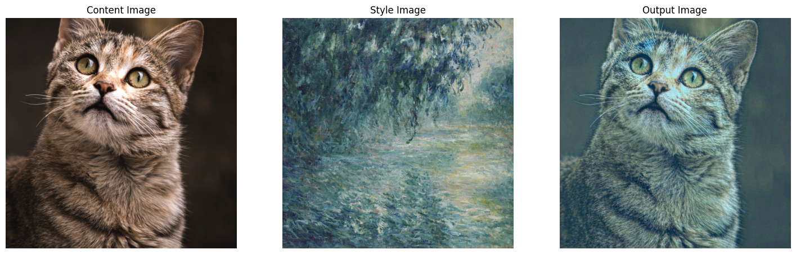

# Fast Neural Style Transfer in PyTorch in [Colab](https://colab.research.google.com/drive/1JHAhTrDtZjd2BqE5z_Mg8LtmQLFza5ln?usp=sharing)

The implementation is based on the paper [Perceptual losses for real-time style transfer and super-resolution](https://arxiv.org/abs/1603.08155) by Johnson et al. (2016). 

Add styles from famous paintings to any photo in a fraction of a second

You can test the method using our pretrained models using the [style of Monet](https://github.com/zoedesimone/fast-style-transfer/tree/main/examples/trained-models) or you can train your own model.

## Atrributions
- The project borrowed some readme/docs from Justin Johnson's [Fast Neural Style](https://github.com/jcjohnson/fast-neural-style)
- The project borrowed some code from [Hang Zhang and Kristin Dana](https://github.com/zhanghang1989/PyTorch-Multi-Style-Transfer) 